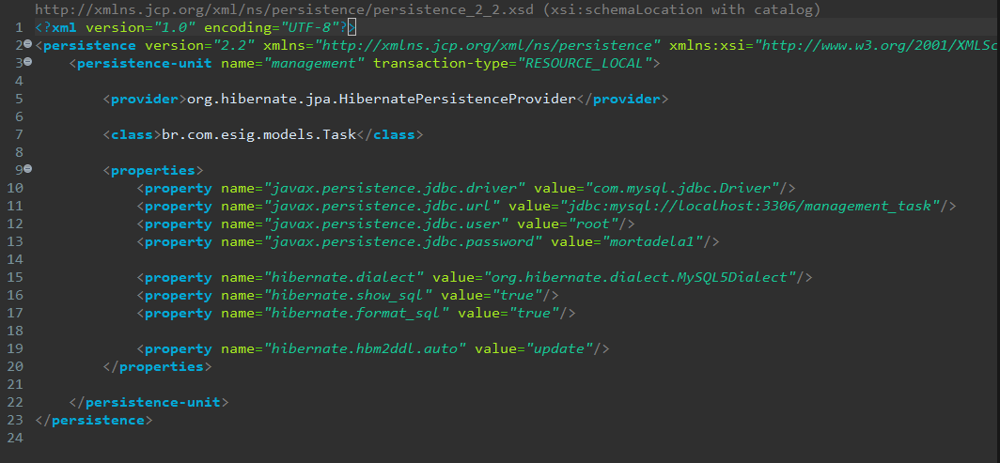
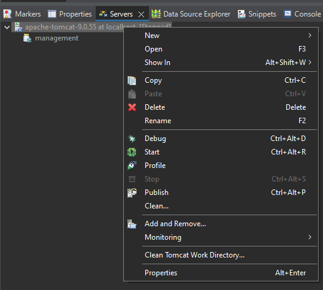

# SISTEMA DE GESTÃO DE TAREFAS

## Descrição Geral

Projeto feito com o intuito de realizar o desafio técnico da empresa [ESIG GROUP](https://esig.group/) para o cargo de **Desenvolvedor back-end java**.

## Descrição do projeto:

Projeto consiste em criar uma aplicação para um gerenciador de tarefas. Onde obrigatóriamente tem as funcionalidades mínimas de:

* Criar uma tarefa.
* Atualizar uma tarefa.
* Remover uma tarefa.
* Listar tarefas.

## Descrição da Api:

- Para clonar o projeto: git clone https://github.com/TaylanTorres09/esig-tech-test
- Para Executar o projeto precisasse:
    - Java [JDK](https://www.oracle.com/java/technologies/downloads/#java17). Este projeto está usando a versão 8.
    - Banco [MySQL](https://www.mysql.com/products/workbench/).

- Como interpretador de código foi utilizado o [eclipse](https://www.eclipse.org/downloads/)

- Configuração do banco de dados no arquivo persistence.xml:

- Vá em Project>Properties>Projets Facets>Runtimes e crie um novo servidor Apache versão 9.

- Depois adicione o projeto no servidor e execute-o.

## Próximos Passos

- Terminar o projeto.
- Resolver bugs com o servidor.

## Autor
 